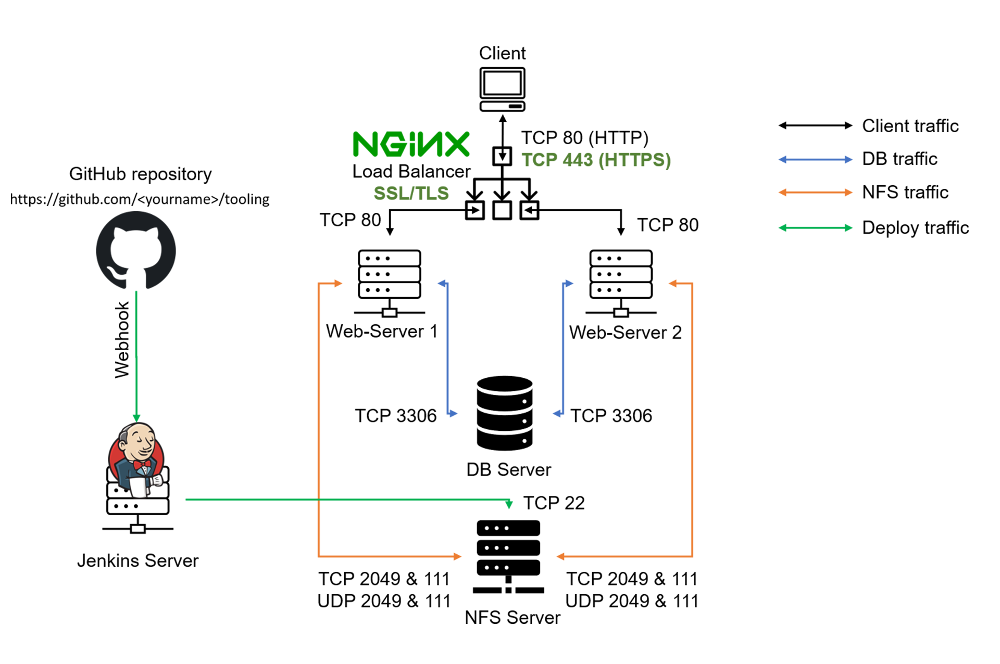

# LOAD-BALANCER-SOLUTION-WITH-NGINX-AND-SSL-TLS

In this project, I have built upon the tooling project. I have configured a Nginx instance as a Load Balancer and registered a new domain name and configured a secured connection using SSL/TLS certificates.

