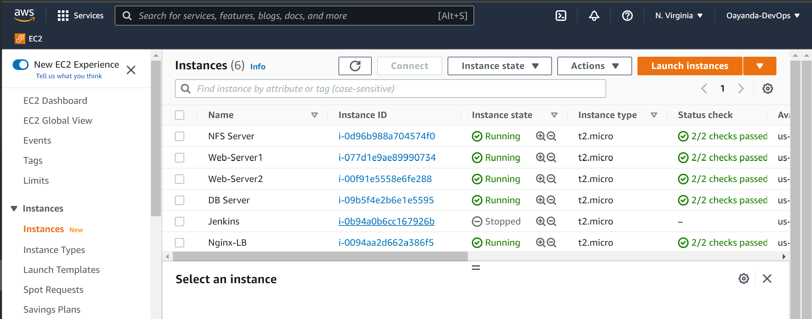
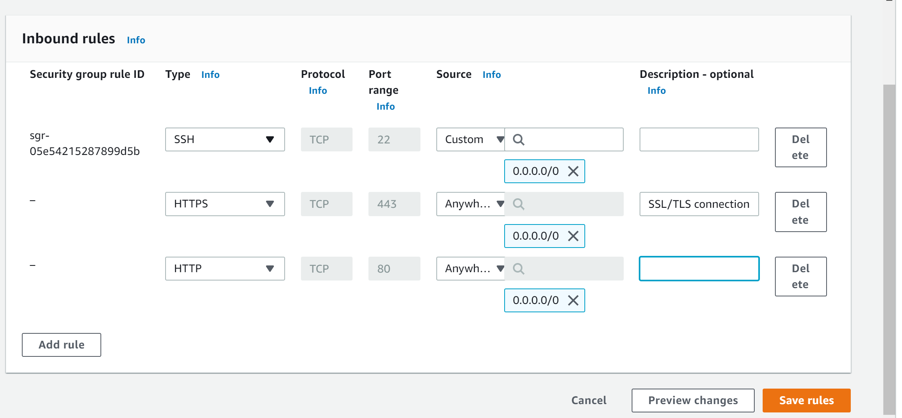
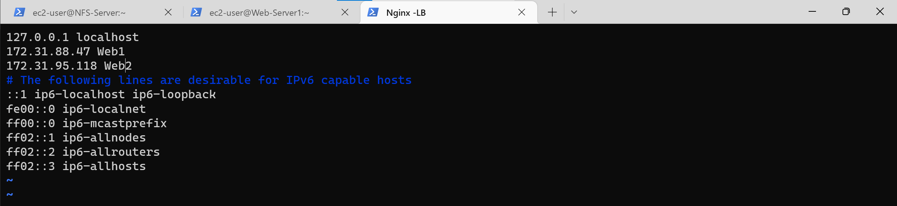
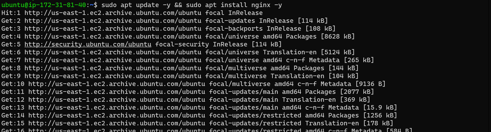

# CONFIGURE NGINX AS A LOAD BALANCER

Create an EC2 VM based on Ubuntu Server 20.04 LTS and name it Nginx-LB.
> Open TCP port 80 for HTTP connection as well port 443 for SSL/TLS connection.


Open ports for HTTP and HTTPS connections


Update /etc/hosts file for local DNS with Web Servers’ names (e.g. Web1 and Web2) and their local IP addresses on Nginx-LB

```bash
sudo vi /etc/hosts
```



Install and configure Nginx as a load balancer to point traffic to the resolvable DNS names of the webservers

```bash
sudo apt update -y && sudo apt install nginx
```

