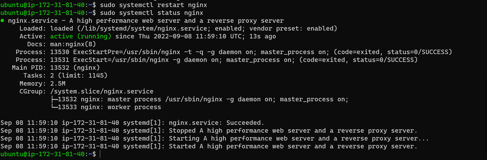

# CONFIGURE NGINX AS A LOAD BALANCER

Create an EC2 VM based on Ubuntu Server 20.04 LTS and name it Nginx-LB.
> Open TCP port 80 for HTTP connection as well port 443 for SSL/TLS connection.


Open ports for HTTP and HTTPS connections


Update /etc/hosts file for local DNS with Web Servers’ names (e.g. Web1 and Web2) and their local IP addresses on Nginx-LB

```bash
sudo vi /etc/hosts
```


Install and configure Nginx as a load balancer to point traffic to the resolvable DNS names of the webservers

Update the instance and Install Nginx

```bash
sudo apt update -y && sudo apt install nginx
```


Configure Nginx LB using Web Servers’ names defined in /etc/hosts

Open the default nginx configuration file

```bash
sudo vi /etc/nginx/nginx.conf
```

insert the following line of codes as seen the screenshot below. 

> where ```oayanda.tk``` is domain name to beregistered and Web1 and Web2 are the local DNS created in the ```/etc/hosts``` in the Nginx-LB


Restart Nginx and make sure the service is up and running

```bash
sudo systemctl restart nginx
sudo systemctl status nginx
```



## REGISTER A NEW DOMAIN NAME AND CONFIGURE SECURED CONNECTION USING SSL/TLS CERTIFICATES

Register a new domain name with any registrar of your choice in any domain zone - in this case *```www.oayanda.tk```*


In order to have a static ip for instance - Assign a *```Elastic IP```* to the Nginx LB server and associate your domain name with this Elastic IP

On instance Page, click on *```Elastic IPs```* under the *```Network & Security```* menu


Click on *```Allocate Elastic Ip address```* on the top right of the page.

Optionally - add a tag name and click ```allocate```.

After the Elastic IP is created, it needs to be associated with Nginx-LB instance. 
Click on *```Action```* and select *```Associate Elastic Ip address```*


Select the Nginx-LB instance and Private IP and click ```associate```

Now Nginx-LB has a Elastic IP address


Update A record in the domain registrar for *```oayanda.tk```* to point to Nginx LB using Elastic IP address.
> The "A" stands for "address" and this is the most fundamental type of DNS record: it indicates the IP address of a given domain.

To setup the ```A``` record, we need to use AWS ROUTE 53 - a scalable and highly available Domain Name System service to create NS records.

On the dashboard, type route 53


Under ```DNS management``` click on ```create hosted zone```

In the ```Domain name``` field enter the register domain - in this case *```oayanda.tk```* and the ```Type``` is ```Public hosted zone``` and ```click create hosted zone```.

Currently, the hosted page for ```oayanda.tk``` looks like this below.

Now connect/point the publicly registered domain name nameservers to the ROUTE 53 nameservers (in hosted zone).
To this, copy all the NS records from ROUTE 53 to the registered domain nameserver record and click on change nameservers.


Now we can create a *```A record```* for ( oyanda.tk and www.oayanda.yk ). In the ```Hosted zone details``` page, click on *```Create record```*.
Make sure ```Record type``` is ```A``` and the ```Elastic IP``` as the ```Value``` and click *```create record```*.

Additionally, create a ```A record``` with the ```www``` prefix.


Check that the Web Servers can be reached from your browser using new domain name using HTTP protocol – http://oayanda.tk


Setup HTTPs - Install ```certbot``` and request for an SSL/TLS certificate.

Make sure ```snapd``` service is active and running

```bash
sudo systemctl status snapd
```


Install ```certbot``` for SSL/TLS

```bash
sudo apt install certbot -y
```

Install a module required for certbot

```bash
sudo apt install python3-certbot-nginx -y
```


Request for SSL/TLS certificate ( follow the certbot instructions –  choose which domain you want the certificate to be issued for, the domain name will be looked up from nginx.conf file so make sure you have updated it).

```bash
 sudo certbot --nginx -d oayanda.tk -d www.oayanda.tk
```


Test secured access to the tooling Web Solution by trying to reach https://oayanda.tk


Set up periodical renewal of your SSL/TLS certificate.
By default, LetsEncrypt certificate is valid for 90 days, so it is recommended to renew it at least every 60 days or more frequently.

You can test renewal command in ```dry-run``` mode

```bash
sudo certbot renew --dry-run
```


Best pracice is to have a scheduled job to run renew command periodically. Let us configure a ```cronjob``` to run the command twice a day.

To do so, lets edit the crontab file with the following command and select the edit mode

```bash
crontab -e
```


Paste the following line of code - ```this code will run automatically every 12 hours``

```bash
* 12 * * *   root /usr/bin/certbot renew > /dev/null 2>&1
```

